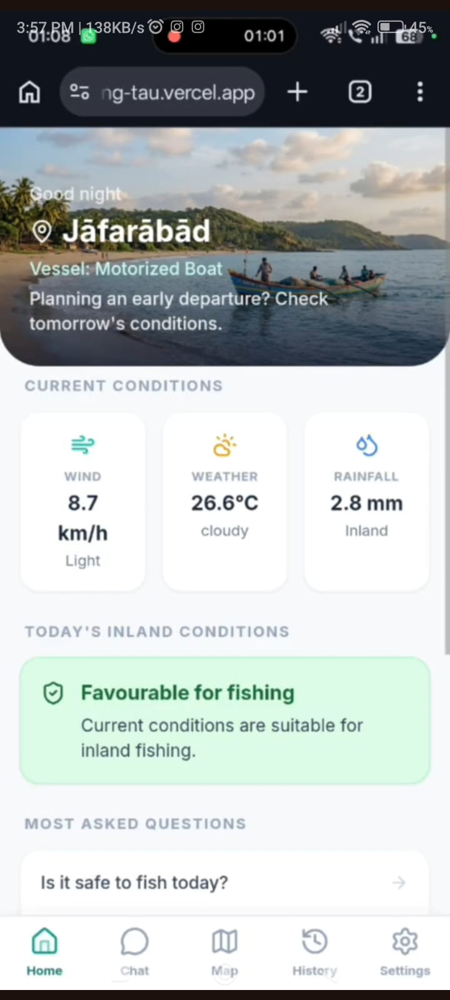
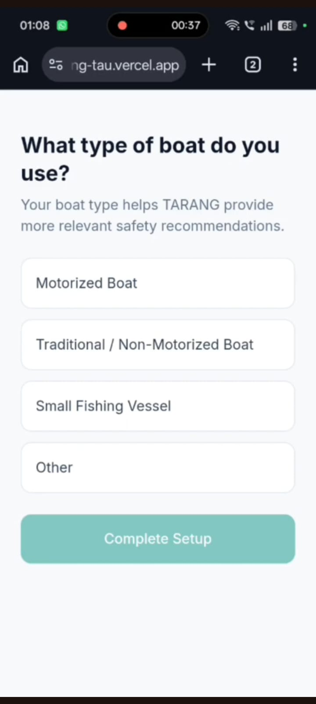
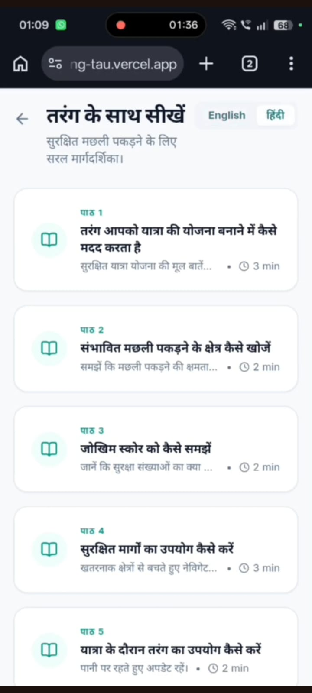
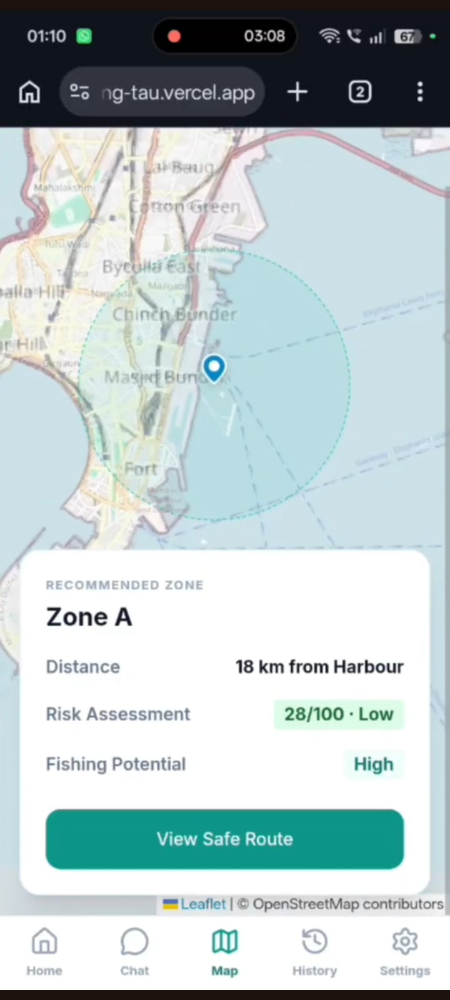
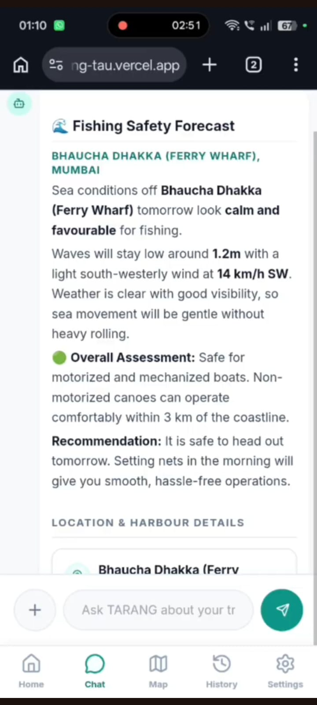
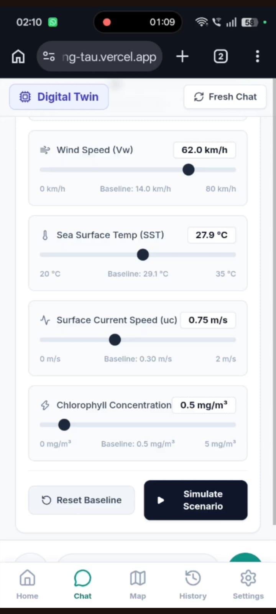
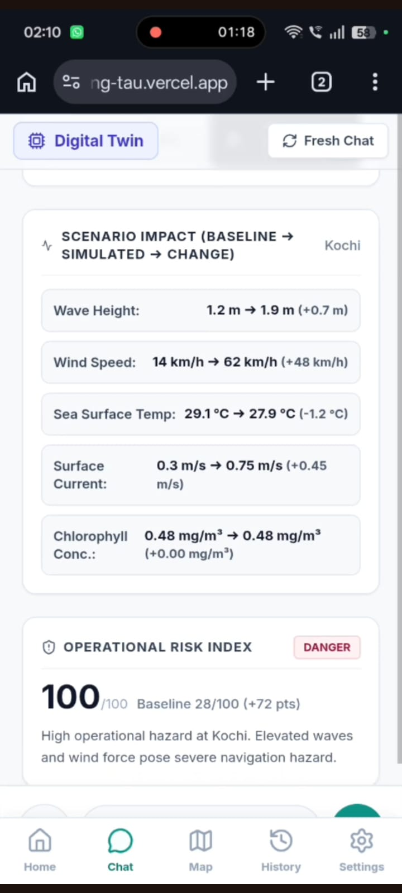
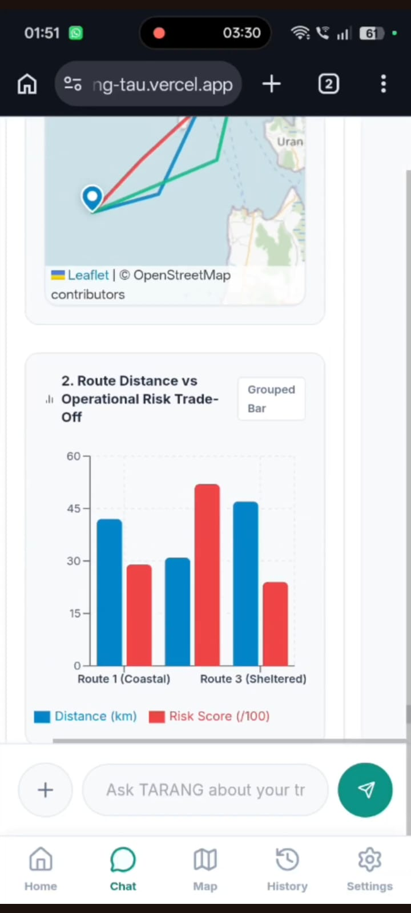
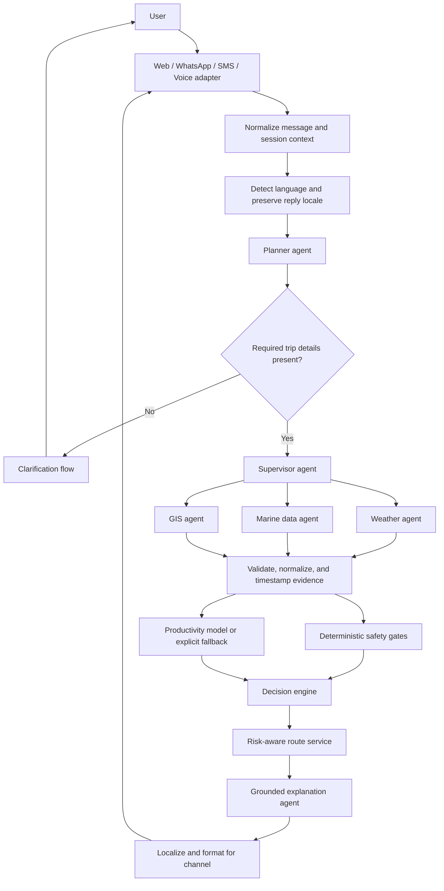

<div align="center">

  

  <h1>🌊 Tarang — ORCA</h1>

  <p>
    <b>Agentic AI-Powered Marine Intelligence & Conversational Decision Support Platform</b>
  </p>

  <p>
    Connecting satellite Earth Observation, marine data, weather intelligence,
    geospatial reasoning, and conversational AI for safer and smarter maritime decisions.
  </p>

</div>

---

# 1. Overview

**Tarang — ORCA** is an **Agentic AI-powered Marine Intelligence Platform** designed to make complex marine, oceanographic, meteorological, and geospatial information accessible through natural-language conversations.

Marine stakeholders such as **fishermen, researchers, coastal authorities, disaster management agencies, and maritime operators** often need to combine information from multiple sources before making operational decisions. Satellite observations, Sea Surface Temperature (SST), chlorophyll concentration, weather forecasts, marine advisories, geospatial boundaries, and location information are distributed across different datasets and services.

ORCA brings these information sources together into a unified conversational decision-support system.

Instead of requiring users to manually search through multiple datasets, APIs, maps, and advisories, users can ask questions such as:

> **"Where is the nearest Potential Fishing Zone today?"**

> **"Is it safe to go fishing tomorrow morning?"**

> **"What are the weather, tide, and sea conditions near my location?"**

> **"Which fishing zones should I avoid because of hazardous conditions?"**

The system interprets the user's intent, identifies the relevant information required, retrieves and correlates marine and environmental data, performs spatial and temporal reasoning, applies safety and productivity analysis, and generates an explainable response.

### Core Design Philosophy

ORCA is designed around five principles:

- **Agentic Reasoning** — decompose complex queries into executable tasks.
- **Multi-source Intelligence** — correlate information from weather, oceanographic, satellite, and geospatial sources.
- **Safety First** — hazardous conditions can override productivity or operational recommendations.
- **Explainability** — recommendations are accompanied by supporting evidence and reasoning.
- **Conversational Accessibility** — users interact through natural language rather than technical data interfaces.

---

# 2. Tech Stack

## Frontend

- **React**
- **TypeScript**
- **Vite**
- **Tailwind CSS / CSS**
- **Leaflet / Interactive Maps**
- **Lucide React**
- Responsive web interface for conversational and geospatial interaction

## AI & Agentic Layer

- **Python**
- **LangGraph** — agent orchestration and workflow management
- **LangChain** — LLM and tool integration
- **Large Language Models** — intent understanding, planning, reasoning, and explanation
- **Multi-agent architecture** for specialized marine intelligence tasks

## Marine Intelligence

- Satellite Earth Observation data
- Sea Surface Temperature (SST)
- Chlorophyll concentration
- Weather forecasts
- Oceanographic observations
- Marine advisories
- Potential Fishing Zone (PFZ) information
- Geospatial and coastal datasets

## Data & Geospatial Processing

- Python
- Pandas
- NumPy
- GeoPandas
- GIS-based spatial analysis
- Spatial and temporal filtering
- Geofencing
- Risk-weighted spatial grids

## Machine Learning

The productivity intelligence layer can use environmental indicators such as:

- Chlorophyll concentration
- SST
- SST gradients
- Chlorophyll gradients
- Seasonality
- Distance from coast
- Bathymetric/depth information where available
- Historical PFZ observations

Candidate models include:

- Scikit-learn
- Logistic Regression
- Gradient Boosting
- XGBoost / LightGBM

## Communication Channels

ORCA is designed for multi-channel interaction:

- Web application
- WhatsApp
- SMS
- Phone / IVR
- Speech-to-Text
- Text-to-Speech

## Language Support

The multilingual layer is designed to support:

- Automatic language detection
- Translation into the internal processing language
- Response generation in the user's original language
- Indian regional languages

Potential language infrastructure includes **Bhashini** and other translation/STT/TTS services.

---

## 📸 A look into TARANG
 
### Dashboard
 
<p align="left">
  
  
  
</p>
 
### Marine Intelligence Map
<p align="left">
  
  
</p>
 
### Conversational Decision Support
<p align="left">
  
  
</p>
 
### Visualisation and Scenario Based Analysis
 <p align="left">
  
  
  
</p>
---
 
## 3. System Architecture


The target request lifecycle keeps agent coordination, evidence gathering, deterministic safety, and user-facing explanation as separate stages:




 
## Agent Responsibilities
 
| Agent / Module | Responsibility |
|---|---|
| Planner Agent | Understands the user request and decomposes it into actionable tasks. |
| Supervisor Agent | Coordinates specialized agents and manages execution flow. |
| Weather Agent | Retrieves and reasons over weather and hazard information. |
| Marine Agent | Processes oceanographic and marine observations such as SST, chlorophyll and PFZ information. |
| GIS Agent | Performs spatial queries, location analysis and geofencing. |
| Safety Engine | Applies deterministic safety rules and hazard gates. |
| Productivity Engine | Estimates relative marine productivity using environmental indicators and ML where available. |
| Decision Engine | Combines safety and productivity information to generate operational candidates. |
| Route Optimizer | Generates risk-aware routes while avoiding unsafe regions. |
| Explanation Agent | Converts analytical results into understandable, evidence-supported responses. |
| Visualization Layer | Presents maps, charts, alerts and spatial intelligence to the user. |
 


# 4. Install & Run Instructions

## Prerequisites

Make sure the following are installed:

- **Node.js 18+**
- **npm**
- **Python 3.10+**
- **Git**

---

## Step 1 — Clone the Repository

```bash
git clone https://github.com/atal887/Tarang.git
cd Tarang
## Step 2 — Install Frontend Dependencies
 
From the project root:
 
```bash
npm install
```
 
## Step 3 — Configure Environment Variables
 
Create a local environment file if required by the configured services:
 
```bash
cp .env.example .env
```
 
Add the required API credentials and service configuration.
 
Typical integrations may include:
 
```env
VITE_API_URL=
VITE_MAP_API_KEY=
VITE_WEATHER_API_KEY=
VITE_LLM_API_KEY=
```
 
> **Never commit API keys or other secrets to GitHub.**
 
## Step 4 — Start the Development Server
 
```bash
npm run dev
```
 
The application will be available at:
 
```
http://localhost:5173
```
 
## Step 5 — Production Build
 
To verify the production build:
 
```bash
npm run build
```
 
The compiled application is generated in:
 
```
dist/
```
 
## Step 6 — Preview the Production Build
 
```bash
npm run preview
```
 
---
 
# 5. What the System Can Do Right Now
 
ORCA combines conversational intelligence with marine data retrieval, environmental reasoning, geospatial analysis, and safety-oriented decision support.
 
| Capability | Description |
|---|---|
| 🗣️ Natural Language Interaction | Users can ask marine and environmental questions using conversational language instead of manually querying individual datasets. |
| 🧠 Intent Understanding | The system identifies the user's objective, location, time period, and relevant contextual information. |
| 🤖 Agentic Task Orchestration | Complex requests can be decomposed into smaller tasks and routed to specialized intelligence modules. |
| 🌦️ Weather Intelligence | Weather information can be retrieved and incorporated into marine decision-making. |
| 🌊 Marine Intelligence | Marine and oceanographic information such as SST, chlorophyll, sea conditions, and advisories can be integrated into responses. |
| 🗺️ Geospatial Reasoning | Location-aware analysis enables the system to reason about coastal regions, fishing zones, boundaries, and spatial relationships. |
| 🎣 PFZ Intelligence | Potential Fishing Zone information can be used to identify and explain potentially productive fishing regions. |
| ⚠️ Safety Analysis | Weather, sea-state, lightning, cyclone, and other hazard indicators can contribute to safety assessment. |
| 🚫 Geofencing | The platform can identify operational boundaries such as restricted areas, protected zones, and maritime boundaries. |
| 📊 Environmental Analysis | Environmental variables can be correlated to identify regions with potentially favourable marine conditions. |
| 🧮 Risk Scoring | A deterministic safety pipeline can combine multiple environmental risk factors into an interpretable risk assessment. |
| 🤖 Productivity Intelligence | Environmental variables such as SST and chlorophyll can be used to estimate relative fishing productivity. |
| 🧭 Route Optimization | Risk-aware route planning can be performed over spatial grids while accounting for hazardous regions. |
| 💬 Contextual Conversations | Users can continue a conversation and refine their original question without repeatedly providing all context. |
| 🌐 Multilingual Architecture | The system is designed to detect user language and return responses in the user's original language. |
| 📱 Multi-channel Architecture | ORCA is designed to support web, WhatsApp, SMS, and voice-based interaction. |
| 📍 Location-aware Queries | Marine information can be interpreted relative to the user's selected or provided location. |
| 📈 Interactive Visualization | Results can be represented through maps, charts, markers, alerts, and other geospatial visualizations. |
| 🔎 Explainable Responses | Recommendations are accompanied by the environmental factors and evidence contributing to the result. |
 
## Safety-First Decision Logic
 
A central design principle of ORCA is that **safety takes precedence over productivity**.
 
For example, a region may show favourable SST and chlorophyll conditions, but if the same region has severe weather or another critical hazard, the system should not recommend it simply because its productivity indicators are favourable.
 
Conceptually:
 
```
Environmental Conditions
        │
        ├── Productivity Analysis
        │
        └── Safety Analysis
                │
                ▼
         Decision Engine
                │
        ┌───────┴────────┐
        │                │
   Unsafe Zone      Potentially Safe
        │                │
     Exclude       Rank / Recommend
```
 
---
 
# 6. Project File Structure
 
The repository is organized to separate the core application, serverless endpoints, documentation, data-processing utilities, and testing infrastructure.
 
```
Tarang/
│
├── api/                              # Serverless API endpoints
│
├── docs/                             # Project documentation & research matrices
│   ├── question_coverage_matrix.md
│   └── question_environmental_taxonomy.md
│
├── scripts/                          # Dataset builders & utility scripts
│   ├── build_dataset.py
│   ├── build_environment.py
│   ├── build_infrastructure.py
│   ├── harbours_scraped.json
│   └── ...
│
├── src/                              # Core Web Application
│   ├── assets/                       # Images, icons and static application assets
│   ├── components/                   # Reusable UI components
│   ├── data/                         # Marine, environmental and application data
│   ├── lib/                          # Shared utilities and helper modules
│   ├── pages/                        # Application pages and major views
│   ├── services/                     # API, data and external-service integrations
│   └── store/                        # Application state management
│
├── tests/                            # Unit, integration and evaluation tests
│   ├── alert_mode_test.ts
│   ├── digital_twin_test.ts
│   ├── research_test_suite.ts
│   └── ...
│
├── public/                           # Static public assets
│
├── package.json                      # Project dependencies and npm scripts
├── package-lock.json                 # Dependency lock file
├── vite.config.ts                    # Vite configuration
├── tsconfig.json                     # TypeScript configuration
└── README.md                         # Project documentation
```
 
## Architectural Separation
 
The repository follows a modular structure:
 
```
src/
│
├── components/    → User interface
├── pages/         → Application views
├── services/      → External APIs and data services
├── data/          → Marine/environmental datasets
├── lib/           → Shared utilities
└── store/         → Application state
```
 
This separation allows new marine data sources, agents, visualization components, and decision-support capabilities to be added without tightly coupling them to the user interface.
 
---
 
# 7. Usage Examples
 
ORCA is designed around real-world marine decision-support scenarios.
 
## Example 1 — Potential Fishing Zone
 
**User:**
 
> Where is the nearest Potential Fishing Zone today?
 
**ORCA:**
 
```
Understanding request...
        ↓
Identify current location
        ↓
Retrieve PFZ / marine information
        ↓
Analyse SST + chlorophyll + spatial proximity
        ↓
Check safety conditions
        ↓
Rank suitable zones
        ↓
Generate explanation + map
```
 
The interface can present:
 
- Recommended fishing zone
- Distance from current location
- SST conditions
- Chlorophyll conditions
- Environmental indicators
- Safety status
- Supporting map
## Example 2 — Fishing Safety
 
**User:**
 
> Is it safe to go fishing tomorrow morning?
 
ORCA considers relevant information such as:
 
- Weather forecast
- Wind conditions
- Wave/sea-state information
- Lightning risk
- Cyclone or severe weather alerts
- Location
- Planned time window
The system then produces a contextual safety assessment rather than simply returning an isolated weather value.
 
## Example 3 — Environmental Analysis
 
**User:**
 
> Which regions have high chlorophyll and favourable sea surface temperature?
 
ORCA can combine:
 
```
Chlorophyll
     +
SST
     +
Spatial Region
     +
Historical / Environmental Context
     ↓
Candidate Marine Regions
```
 
The results can be displayed using an interactive map and supporting environmental information.
 
## Example 4 — Hazard Avoidance
 
**User:**
 
> Which fishing zones should I avoid today?
 
The system can combine:
 
- Marine hazards
- Weather alerts
- Lightning
- Cyclone information
- Geofencing restrictions
- Restricted or protected areas
and identify areas that should be excluded from operational planning.
 
## Example 5 — Conversational Follow-up
 
Users can refine previous requests:
 
**User:** "Find a suitable fishing zone near Kochi."
 
**ORCA:** "Several candidate zones are available..."
 
**User:** "Which one is safer tomorrow morning?"
 
**ORCA:** "Considering the forecast conditions tomorrow morning, Zone B has lower associated environmental risk..."
 
This allows marine queries to evolve through a multi-turn conversation rather than requiring a completely new query every time.
 
---
 
